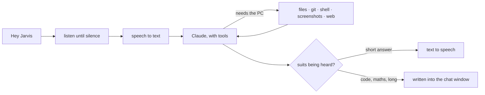

# J.A.R.V.I.S

A voice assistant for Windows with a dry butler streak. Say **"Hey Jarvis"**, talk normally, and it answers
out loud — or, when the answer is something to read rather than hear, writes it into a dashboard that does
what a desktop AI chat app does: saved conversations, streaming Markdown, syntax-highlighted code, maths,
diagrams, file edits and shell commands on the machine it's running on.

Python 3.13 · Windows · Claude API · no build step, no framework, no CDN

<!-- Drop a screenshot in here: Win+Shift+S, save as docs/dashboard.png
 -->

---

## What it does

**By voice.** The wake word runs locally and free (openWakeWord), so nothing leaves the machine until you
actually say something. After "Hey Jarvis" it stays awake and you talk freely — no wake word between
questions — until you say "go offline" or leave it quiet for a couple of turns.

**In the chat window.** Two views, switched in the header:

- **Dashboard** — an animated orb that tracks what it's doing, CPU and memory meters, weather, Spotify with
  transport controls, uptime and counters.
- **Chats** — a sidebar of saved conversations, pinned and grouped by date, searchable across every message.
  Each chat keeps its own history and model; all of them share one long-term memory.

Replies stream in as they're written, with headings, tables, lists, fenced code, KaTeX maths and Mermaid
diagrams. Attach images, PDFs or text files by dragging, pasting or browsing. Retry a reply, edit an earlier
message and continue from there, or stop one mid-sentence and keep what was written.

**On the PC.** 30 tools: read, write and edit files with diffs and backups; find files and grep inside them;
run PowerShell commands and Python scripts; git status, commit, push and pull; take a screenshot of any
window and look at it; open apps, files and folders from a rough name; write Obsidian notes; control
Spotify; search the web; draw diagrams, charts and small interactive demos into the chat; and remember
things about you between sessions.

**Guardrails**, because it has real reach:

| Risk | What stops it |
|---|---|
| Arbitrary commands | Every command and script shows you the exact text and waits: run once, allow for this chat, or deny. A spoken "yes" works during a voice request. |
| Wandering the filesystem | The first touch of any folder asks; a yes covers that repo for that chat only. Its own workspace is the sole exception. |
| Leaking secrets | `.env`, SSH keys, `.pem`/`.key`/`.pfx`, `.netrc` and friends are refused before permission is even asked, and stripped back out of any commit. |
| Untrusted HTML in replies | Interactive visuals run in a sandboxed iframe with a CSP that blocks network access; all Markdown and SVG is sanitized. |
| Other sites reaching it | The server binds to 127.0.0.1 and the WebSocket refuses every Origin but its own. |
| Silent runaway | Stop kills the reply, any running command, and its child processes. |

## How it works



The last step is the one worth explaining: speech is slow and you can't skim it, so anything long or full of
code, maths, steps or tables is written into the chat in full, and only a line like *"It's in the chat, sir."*
is read aloud. Quick facts are still just spoken.

## Setup

```powershell
git clone https://github.com/NikhilAmbavaram/JARVIS.git
cd JARVIS
python -m venv venv
.\venv\Scripts\activate
pip install -r requirements.txt
python list_audio.py            # downloads the wake-word models, once
```

Create a `.env` next to the code (see `.env.example`):

```
ANTHROPIC_API_KEY=sk-ant-...
OPENAI_API_KEY=sk-...
SPOTIFY_CLIENT_ID=...           # optional
```

**Pick your microphone.** The input device number is hard-coded in `voice.py` and `wake.py` as `device=6`.
List yours with `python -m sounddevice` and set both to the right number, or the wake word will sit there
hearing silence.

## Running it

```powershell
python .\gui.py                 # the dashboard, in its own Edge window
python .\gui.py --no-voice      # chat only, no microphone
python .\gui.py --browser       # in a normal browser tab instead
python .\jarvis.py              # terminal only, voice and no dashboard
```

`.\make_shortcut.ps1` creates a Desktop shortcut with the orb icon that starts it with no console window.

## Spotify (optional)

Create an app at [developer.spotify.com](https://developer.spotify.com/dashboard) with the redirect URI
`http://127.0.0.1:8888/callback`, put the client ID in `.env`, then run
`python -c "import tools; tools.spotify_login()"` once. Premium is required by the Web API. Without it the
playback buttons fall back to the keyboard's media keys.

## Layout

| | |
|---|---|
| `gui.py` | The dashboard: web server, WebSocket, voice loop, approvals, chats |
| `jarvis.py` | The terminal version: wake, listen, think, speak, repeat |
| `brain.py` | One conversation with Claude — streaming, tool rounds, history budget, thinking |
| `tools.py` | Everything it can do, plus the permission and approval rules |
| `chats.py` | Saved chats in SQLite, with full-text search |
| `memory.py` | Facts it keeps between sessions, shared by every chat |
| `voice.py`, `wake.py` | Microphone, speakers, wake word |
| `dashboard.py` | System stats and weather |
| `config.py` | Keys, model choice, and the personality prompt |
| `ui/` | The page: plain HTML, CSS and JS, no build step |
| `ui/vendor/` | marked, DOMPurify, highlight.js, KaTeX, Chart.js, Mermaid — vendored so the chat renders with no internet |

## Cost

Voice answers on Haiku 4.5 for speed, typed chats start on Opus 5 and can be switched per chat. A spoken
question runs about a cent; a typed one on Opus is nearer five, more if the conversation is long, since the
whole chat is re-sent each turn. Speech costs pennies an hour on top. Prompt caching is on, which cuts
repeated context to roughly a tenth for a few minutes after each turn.

## Notes

- Windows only, by design: screenshots use `PrintWindow`, apps are found through `Get-StartApps`, and
  commands run in PowerShell.
- The dashboard opens in Edge's app mode, which ships with Windows. `--browser` uses your default instead.
- Chats, memory, settings and the scratch workspace stay on the machine, in files next to the code.
